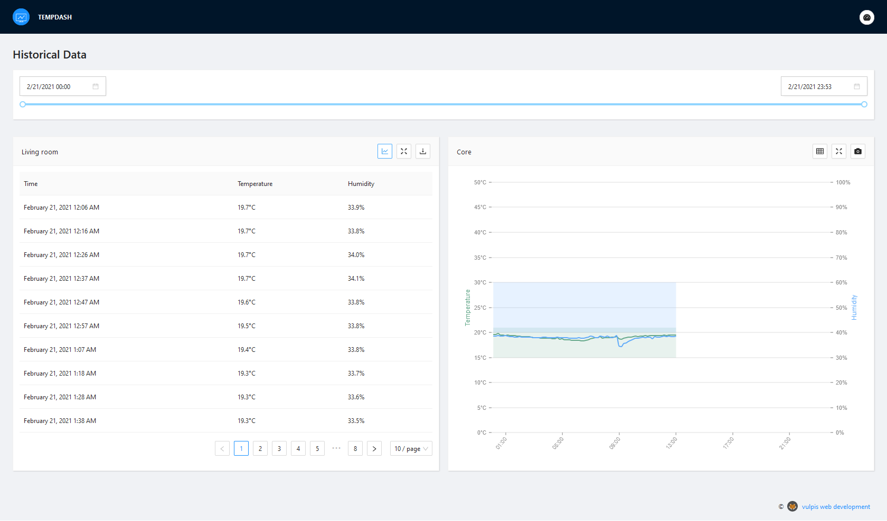

# TempDash 

TempDash is a dashboard application to monitor your (indoor) climate.

---

## Repository content

This repository consists of two main components:

- sensors: flash sensors to read from DHT22 sensors and push data to firebase
- frontend: to consume sensor data from firebase

---

## Project tech stack

Hardware:

- Wemos D1 mini
- DHT22 temperature & humidity sensor
- 10 KOhm resistor
- Wires

Software:

- Firebase realtime database
- Arduino .ino scripts see `/sensors`
- Frontend: ReactJS / TypeScript

---

## Frontend screenshots

First view:

Toggle off the left info bar:

Toggle on the large graph view:

Toggle on the table view for one graph:

Download graph image:

